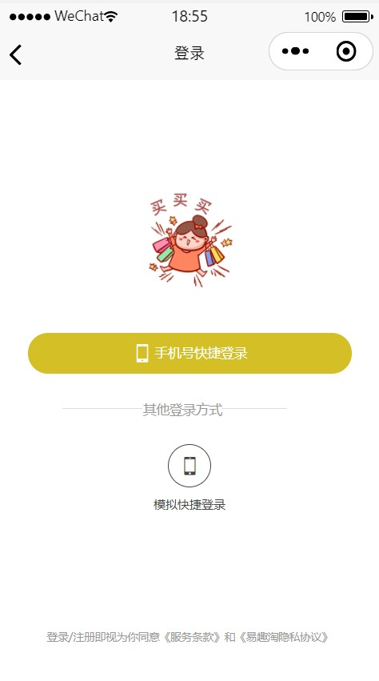
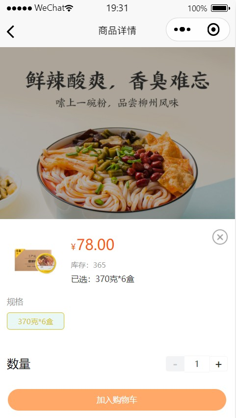

# 一、项目简介
## 易趣淘小程序是一个提供集商品展示、购买、支付、订单管理等功能于一体的综合性购物平台，满足用户的购物需求，提升购物体验，并促进用户与平台之间的长期互动和合作
# 二、功能模块&主要截图
## 1. 首页模块

## 2. 推荐模块

## 3. 分类模块

## 4. 详情模块

## 5. 登录模块

## 6. 用户模块

## 7. 地址模块

## 8. SKU 模块

## 9. 购物车模块

## 10. 订单模块

# 三、主要技术栈
## vue3、typescript、uniapp、pina、uni-u

